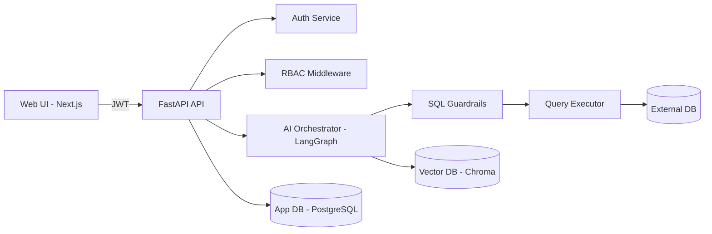

Perfect — **Phase 0** is where most projects either succeed quietly or fail loudly.
This phase is about **decisions, scaffolding, and guardrails**, not features.

I’ll give you:

1. What Phase 0 actually means
2. Detailed responsibilities
3. Development architecture (logical + physical)
4. Technology stack (with reasons)
5. Project setup steps
6. Final folder structure (backend + frontend)

No fluff. This is **engineering-grade**.

---

## PHASE 0 — Platform Foundations & System Bootstrapping

### Goal of Phase 0

Create a **secure, extensible, AI-ready foundation** so that:
• RAG
• NL-to-SQL
• Role-based execution
• Multi-database support

can be added **without refactoring later**.

Phase 0 ends when:
• App runs locally
• Login works
• DB connection works
• Empty AI pipeline is wired
• UI loads editor shell

---

## 0.1 Development Architecture (Conceptual)


### Logical Architecture

```
┌───────────────┐
│  Web Client   │  (Next.js + Monaco)
└───────┬───────┘
        │ HTTPS / JWT
┌───────▼───────┐
│ Backend API   │  (FastAPI)
│ - Auth        │
│ - RBAC        │
│ - API Gateway │
└───────┬───────┘
        │
┌───────▼────────┐
│ AI Orchestrator│  (LangGraph)
│ - RAG          │
│ - SQL Gen      │
│ - Guardrails   │
└───────┬────────┘
        │
┌───────▼───────────┐
│ Query Executor    │
│ - Policy Check    │
│ - SQL Validator   │
└───────┬───────────┘
        │
┌───────▼─────────────┐
│ External Databases  │
│ PostgreSQL / MySQL  │
└─────────────────────┘
```

---

## 0.2 Physical Deployment Architecture (Phase 0)

```
Local Machine / Dev Server
│
├── Backend (FastAPI)
│   ├── App DB (PostgreSQL)
│   ├── Vector DB (Chroma)
│   └── AI APIs
│
└── Frontend (Next.js)
```

No Kubernetes yet. No cloud yet.
**Local-first, reproducible dev environment.**

---

## 0.3 Technology Stack (Finalized)

### Backend (Non-negotiable)

| Purpose    | Tech           | Why                    |
| ---------- | -------------- | ---------------------- |
| API        | FastAPI        | Async, modern, OpenAPI |
| Auth       | JWT + OAuth2   | Stateless, scalable    |
| Passwords  | bcrypt         | Industry standard      |
| ORM        | SQLAlchemy 2.0 | Mature + async         |
| Migrations | Alembic        | Safe DB evolution      |
| Validation | Pydantic v2    | Strict schemas         |
| Config     | dotenv         | Environment safety     |

---

### AI / RAG Layer (Wired, Not Used Yet)

| Purpose         | Tech                |
| --------------- | ------------------- |
| Agent Graph     | LangGraph           |
| LLM Abstraction | LangChain           |
| Embeddings      | OpenAI / Instructor |
| Vector DB       | ChromaDB            |
| SQL Parsing     | SQLGlot             |

(LLM calls will be mocked in Phase 0)

---

### Frontend

| Purpose   | Tech                 |
| --------- | -------------------- |
| Framework | Next.js (App Router) |
| Language  | TypeScript           |
| UI        | Tailwind + shadcn/ui |
| Editor    | Monaco Editor        |
| Auth      | NextAuth             |
| State     | Zustand              |

---

### DevOps / Tooling

| Purpose         | Tool           |
| --------------- | -------------- |
| Version Control | Git            |
| API Docs        | Swagger        |
| Linting         | Ruff           |
| Formatting      | Black          |
| Pre-commit      | Hooks          |
| Env             | Docker (later) |

---

## 0.4 Phase 0 Responsibilities Breakdown

### 1. Authentication & RBAC Skeleton

Implement:
• User table
• Role table
• JWT issuance
• Role injection into request context

No permissions enforced yet — **only wiring**.

---

### 2. Database Connection Manager (Skeleton)

User inputs:
• DB type
• Connection string

System:
• Validates connection
• Stores encrypted metadata
• No schema ingestion yet

---

### 3. AI Pipeline Stub (Very Important)

Create LangGraph **without real intelligence**:

```
User Query → Dummy SQL → Block Execution
```

Why?
So future AI nodes plug in cleanly.

---

### 4. Frontend Shell

UI shows:
• Login page
• Dashboard
• Query editor layout
• Disabled “Run” button

No data yet.

---

## 0.5 Development Architecture Diagram (Mermaid)

You can directly use this in docs.



---

## 0.6 Backend Project Structure (Final)

```
backend/
├── app/
│   ├── api/
│   │   ├── auth.py
│   │   ├── users.py
│   │   ├── db_connections.py
│   │   └── query.py
│   │
│   ├── auth/
│   │   ├── jwt.py
│   │   ├── hashing.py
│   │   └── dependencies.py
│   │
│   ├── core/
│   │   ├── config.py
│   │   ├── security.py
│   │   └── logging.py
│   │
│   ├── models/
│   │   ├── user.py
│   │   ├── role.py
│   │   └── db_connection.py
│   │
│   ├── ai/
│   │   ├── graph.py
│   │   ├── nodes/
│   │   │   ├── intent.py
│   │   │   ├── sql_generator.py
│   │   │   └── validator.py
│   │
│   ├── db/
│   │   ├── session.py
│   │   ├── base.py
│   │   └── migrations/
│   │
│   ├── main.py
│   └── __init__.py
│
├── alembic.ini
├── requirements.txt
└── .env
```

---

## 0.7 Frontend Project Structure

```
frontend/
├── app/
│   ├── login/
│   ├── dashboard/
│   ├── editor/
│   └── layout.tsx
│
├── components/
│   ├── Navbar.tsx
│   ├── Editor.tsx
│   └── ProtectedRoute.tsx
│
├── store/
│   └── auth.ts
│
├── styles/
│   └── globals.css
│
├── lib/
│   ├── api.ts
│   └── auth.ts
│
└── middleware.ts
```

---

## 0.8 Phase 0 Checklist (Completion Criteria)

You should be able to:

* Start backend server
* Create users with roles
* Login and receive JWT
* Open frontend dashboard
* See editor UI
* Store DB connection metadata
* Trigger dummy AI pipeline

Nothing intelligent yet — **but everything wired correctly**.

---

### Suggested Next Move

Next logical step is **Phase 1: Schema Ingestion + Metadata Intelligence**
That’s where the system becomes “aware” of databases.

If you want, next I can:
• Write **Phase 1 in same depth**
• Write **actual FastAPI auth code**
• Design **LangGraph node contracts**
• Create **RBAC permission matrix**
